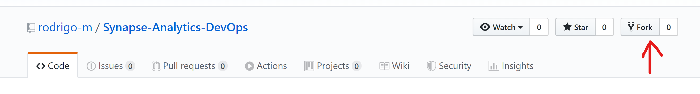
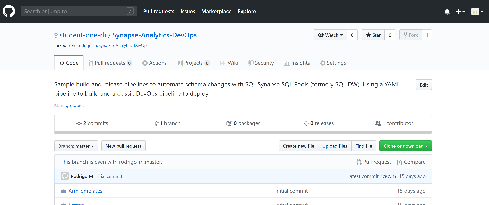

Log in with your GitHub account at https://github.com

Go to https://github.com/rodrigo-m/Synapse-Analytics-DevOps

Click Fork on the top right of the screen:

You should see the copied repository in your account after a few seconds. In the example below, the account name is "student-one-rh". You will see your GitHub account name instead of "student-one-rh".`   

For further information on forking:
https://guides.github.com/activities/forking/