# Synapse-Analytics-DevOps
Sample build and release pipelines to automate schema changes with SQL Synapse SQL Pools (formery SQL DW). Using a YAML pipeline to build and a Classic DevOps pipeline to deploy.

To get it working on your environment, follow the steps below.
## Pre-requisites

In summary you will need a GitHub Account, an Azure DevOps account, your own copy of this repo, and an Azure DevOps Project.

1. [Sign up](https://help.github.com/en/github/getting-started-with-github/signing-up-for-a-new-github-account) or sign in to GitHub. 
2. Make sure you are signed in to your GitHub account, then go to https://github.com/rodrigo-m/Synapse-Analytics-DevOps (this repo) and click "Fork" on the top right to [create a copy of this repository](https://guides.github.com/activities/forking/) in your account.  
2. [Sign up or sign in to Azure DevOps](https://docs.microsoft.com/en-us/azure/devops/user-guide/sign-up-invite-teammates?view=azure-devops).
3. [Create a project](https://docs.microsoft.com/en-us/azure/devops/organizations/projects/create-project?view=azure-devops&tabs=preview-page) in Azure DevOps. Select Git as your source control on step 3. 

## Create a Build Pipeline (YAML)

In this section you will create a pipeline and reference the GitHub repository you forked. Azure DevOps will recognize a file 

Open your Azure DevOps project, select Pipelines under Pipelines, then click "Create Pipeline"

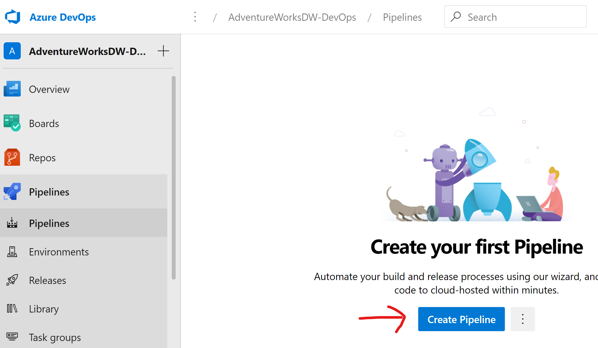

Select Github 

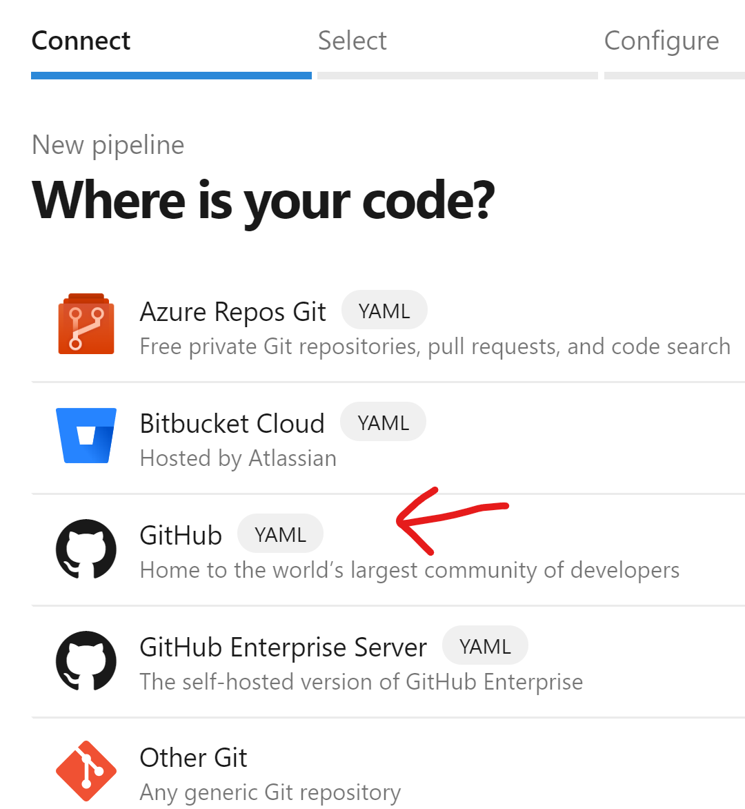

Click the green button "Authorize AzurePipelines"

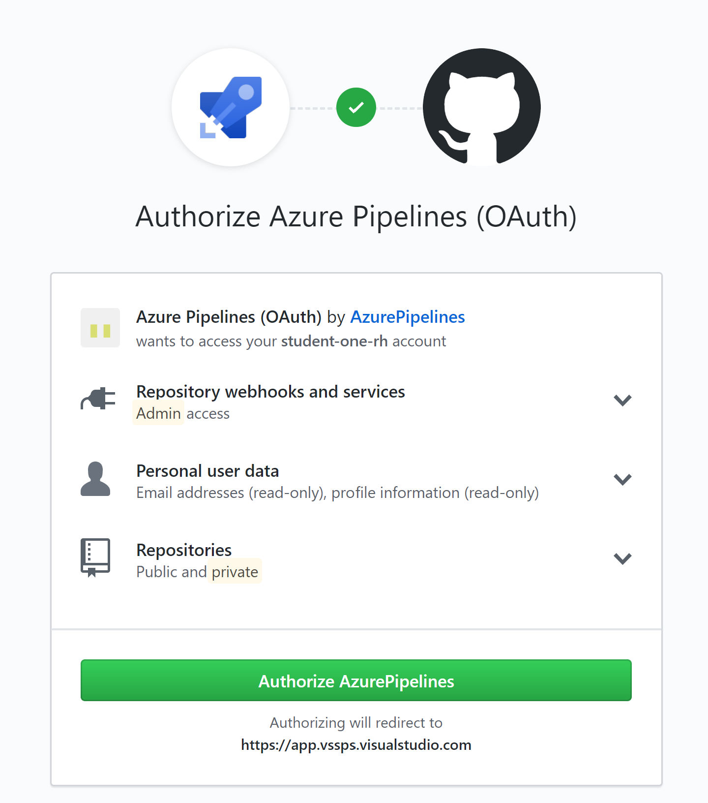

Select the repository you forked earlier: 

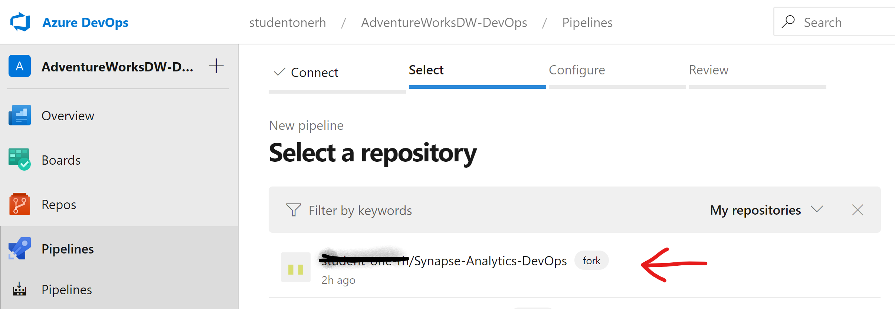

Click Approve & Install

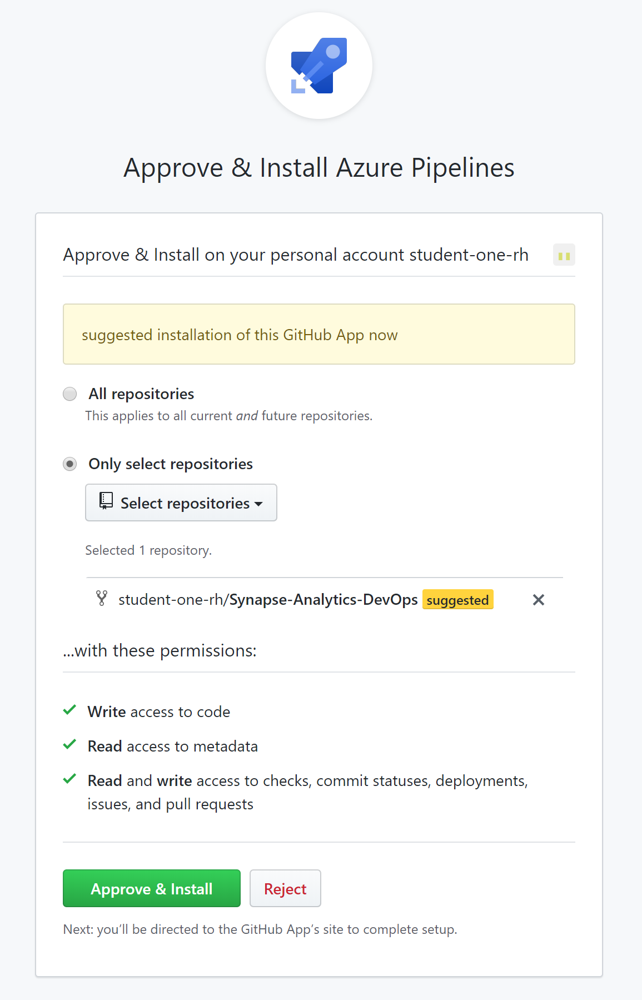

You may be required to select your AzureDevOps account, and after this you will land back on "Review your Pipeline" within your Azure DevOps project. You will see the YAML pipeline that builds the AdventureWorksDW project, i.e. will read the database code and generate a dacpac for deployment. 

Note that Azure DevOps recognized the standard name "azure-pipelines.yml" at the root of the repo. This file has a pipeline that essentially builds the database project and copies some scripts to the output area called "drop". The collection of files produced by this pipeline, the artifacts, will be referenced in the Release pipeline.  

Click "Run" to save and run this pipeline.  

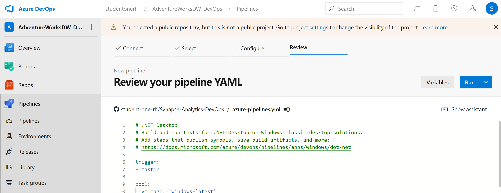

Make sure your pipeline run is successful before you proceed: 

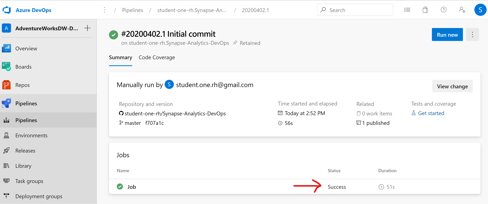

## Clone the repository to your local machine

You could leave this step for last if you download the "AdventureWorksDW-release-pipeline.json" to your local computer. This is the Classic pipeline definition we will use in the next section. 

To start, go to the GitHub Repository you forked, click on the green button "Clone or Download" then copy the URL of the forked repository:

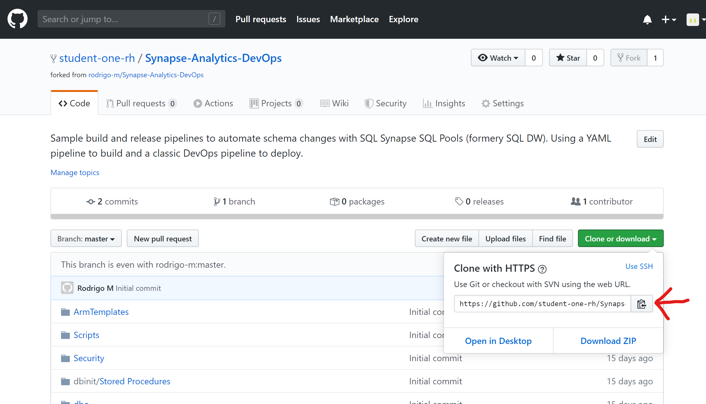

Now open Visual Studio. Skip the welcome screen by clicking "Continue Without Code" in the lower right portion of the screen if applicable. 

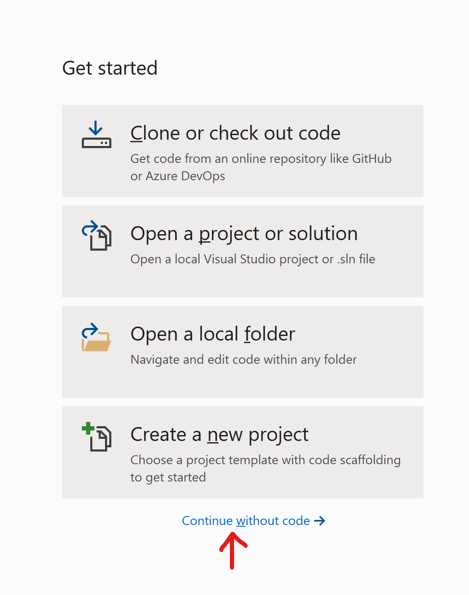

On the top right area of the screen, click the green plug to "Manage Connections"

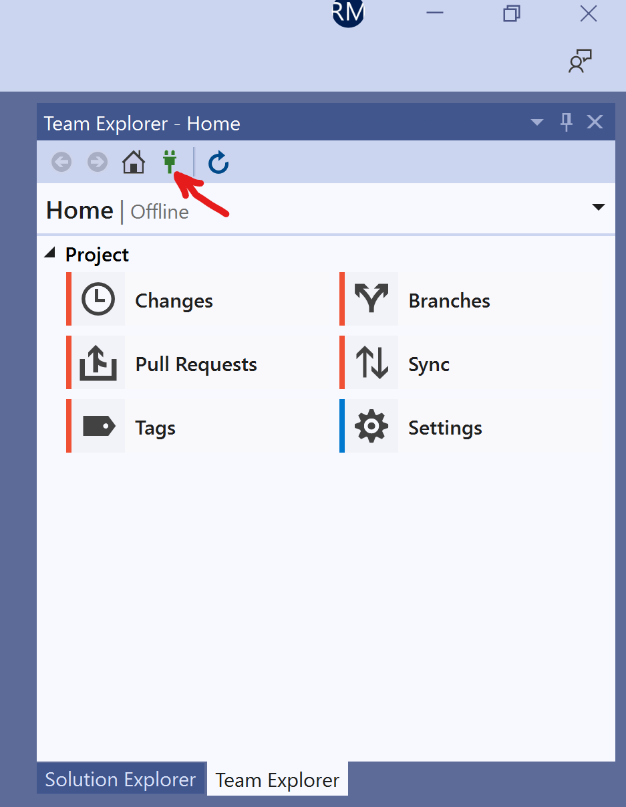

Under "Local Git Repositories" click "Clone", then paste the URL of the repository you forked and select the local folder where the local repo will live. 

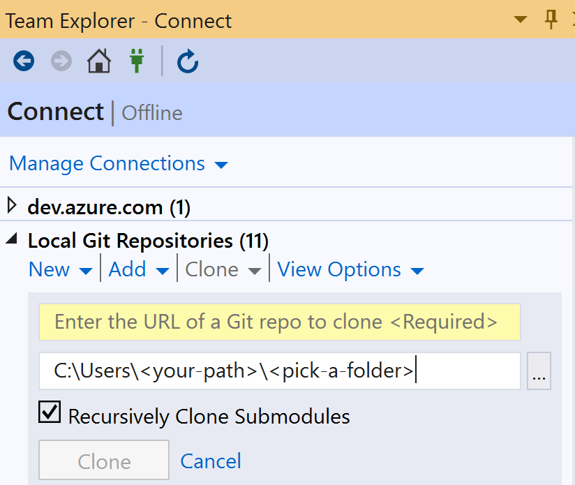

After a copy of the repository is downloaded to your machine, you can open the AdventureWorksDW solution by double-clicking AdventureWorksDW.sln

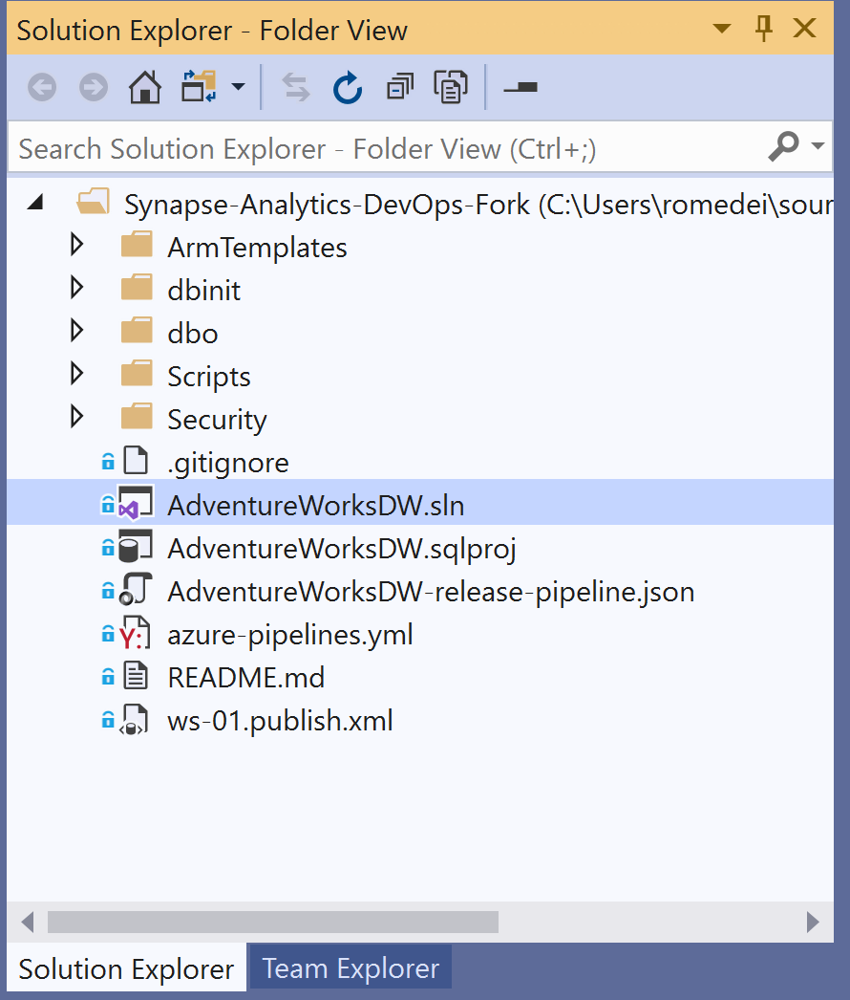

Now select "Build" then "Build Solution" on the top menu and confirm that you can build your solution locally:

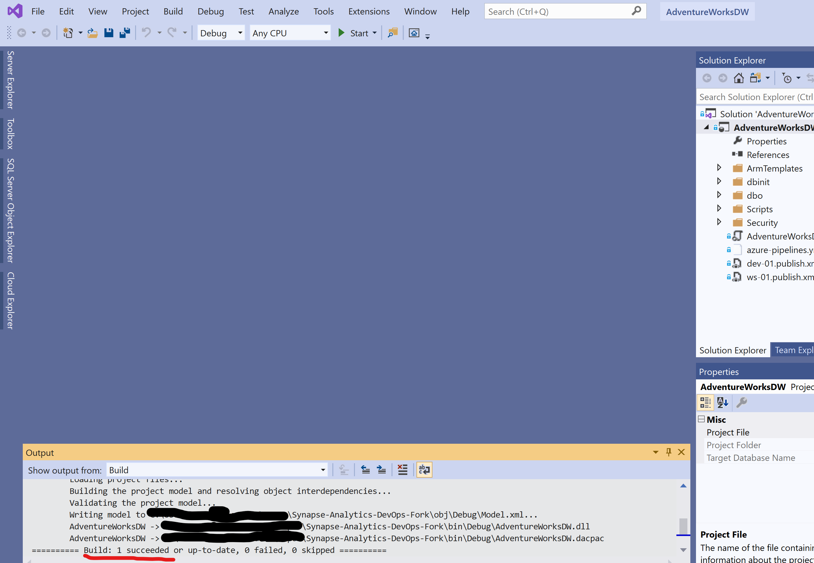

## Import a deployment pipeline

You will now import a Classic Pipeline, which another way to define a series of tasks, different from the text-based YAML standard used in the build pipeline you created earlier.

To get started, click on "Releasese" under "Pipelines" on the left menu, then click on "New Pipeline"

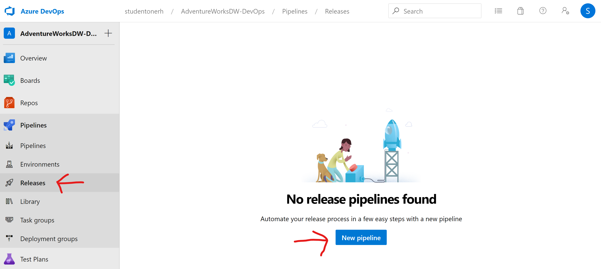

Click on "Empty Job"

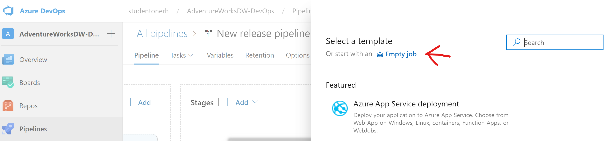

Save your empty job. You can save this pipeline at the root level "\":

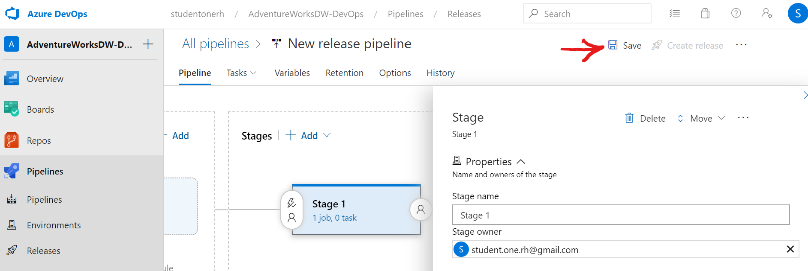

Now click browse, then select the local folder where you cloned the forked repository into, then select the file "AdventureWorksDW-release-pipeline.json:

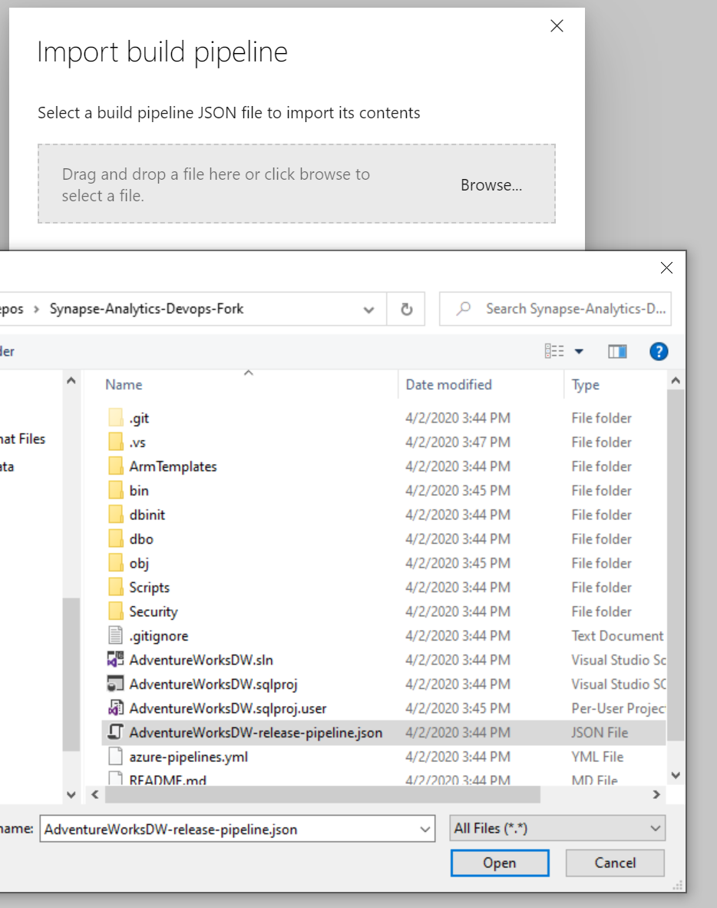

